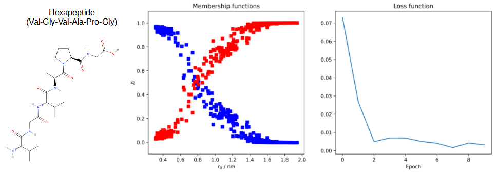

# P4-Molecular-Dynamics_Neural-Networks 
Molecular Dynamics simulations generate the time evolution of the positions of the atoms of a molecular system over time.
However, events of interest from a chemical-biological point of view, the transitions between metastable states, are only rarely observed, even in very long trajectories. This project aimed to develop new methodologies to determine such events and estimate kinetic physical properties using neural networks.

### Exercise 1
- Learn how to implement a numerical integrator to solve a stochastic differential equation
- Learn how to implement a neural network to approximate the Boltzmann distribution of one-dimensional systems.

### Exercise 2
- Learn how to implement ISOKANN, an iterative algorithm based on neural networks, to identify the membership functions of one-dimensional systems.

### Exercise 3
- Learn how to implement ISOKANN to identify the membership functions of an Hexapeptide.
